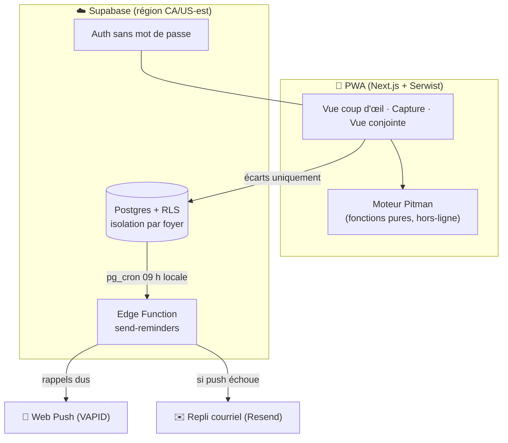

<div align="center">

# 🏭 GRANDFORD

### La prothèse de mémoire partagée pour les couples en horaire rotatif 12 h

*Parce que l'horaire n'est pas le problème — ce sont les **écarts** qui font dérailler la semaine.*

<br />

[](https://www.typescriptlang.org/)
[](https://nextjs.org/)
[](https://react.dev/)
[](https://supabase.com/)
[](https://web.dev/progressive-web-apps/)
[](#-qualité--portes-de-sprint)
[](./ROADMAP.md)

</div>

---

## 📖 Le problème, en une phrase

Un travailleur d'usine tourne sur un cycle **Pitman 2-2-3** : deux jours de travail, deux de repos, trois de travail… en quarts de **12 heures**, alternant jour (07 h–19 h) et nuit (19 h–07 h). L'horaire « normal » est parfaitement prévisible — n'importe qui peut le calculer d'avance. Ce qui casse la vie de couple, ce sont les **écarts** : un *overtime* accepté à la dernière minute, un congé maladie, une formation, un échange de quart. Ces changements vivent dans la tête d'une seule personne, et l'information n'arrive jamais — ou trop tard — à la conjointe.

**GRANDFORD est une PWA pensée pour un couple TDAH** : capturer un écart en **3 taps**, le diffuser automatiquement à l'autre, et le rappeler **1 mois / 1 semaine / 1 jour** à l'avance. La valeur n'est pas le calendrier — c'est la **fiabilité des exceptions** et leur **diffusion sans friction**.

> 🔐 **Principe de confidentialité structurelle** : la conjointe voit *qu'il y a* une absence, jamais **pourquoi**. Le motif d'une exception ne transite jamais vers sa vue — pas même dans un *payload* non affiché.

---

## ✨ Fonctionnalités du MVP

| | Fonction | En clair |
|---|---|---|
| 👁️ | **Vue « coup d'œil »** | L'accueil affiche l'état du jour (CONGÉ / JOUR / NUIT / SOMMEIL) lisible en **moins de 2 secondes**, plus une bande semaine et une grille mois navigable. |
| 🧮 | **Moteur déterministe** | L'horaire normal est **calculé à la volée**, côté client — il s'affiche **hors ligne**, sans jamais dépendre du réseau. |
| ✍️ | **Capture en ≤ 3 taps** | Bouton → 6 tuiles (OT, congé, maladie, formation, vacances, échange) → confirmation. L'*overtime* se note en **2 taps**. |
| 🤫 | **Vue conjointe étanche** | Disponibilité partagée (travaille / disponible / sommeil) — **zéro motif**, garanti côté base de données *et* côté réseau. |
| 😴 | **Fenêtre de sommeil** | Après un quart de nuit, le sommeil est dérivé automatiquement (fenêtre configurée, sinon heuristique) et ajustable jour par jour. |
| 🔔 | **Rappels automatiques** | Chaque écart matérialise des rappels à **30 / 7 / 1 jour**, livrés en **Web Push** avec repli **courriel**. |
| 👫 | **Foyer multi-membres** | Auth sans mot de passe (lien magique), invitation de la conjointe, sélection d'équipe A/B/C/D. |

*Découpage complet des exigences (FR-1 → FR-17) : voir `docs/analyse/02-analyse/analyse.md`.*

---

## 🧮 Le cœur : le moteur Pitman

Tout repose sur une intuition simple, validée sur des dates réelles : le cycle 2-2-3 des quatre équipes se réduit à **un binaire**. À chaque jour, soit le super-quart **A+C** travaille, soit c'est **B+D** — jamais les deux, jamais aucun. Connaître **une ancre** et **un motif de 14 jours** suffit à reconstituer n'importe quelle date, passée ou future.

```
Équipes   A ─┐                     ┌─ jour (07 h → 19 h)
          C ─┴─ super-quart A+C ───┤
          B ─┐                     └─ nuit (19 h → 07 h)
          D ─┴─ super-quart B+D
          
A+C et B+D sont strictement complémentaires : quand l'un travaille, l'autre se repose.
```

Le moteur (`lib/engine/`) est constitué de **fonctions pures** : aucune I/O, aucun appel réseau, **aucune horloge système** — la date est toujours un paramètre. Il tourne donc à l'identique côté client et côté serveur, et **aucun jour généré n'est jamais stocké** : seuls les écarts sont persistés.

```typescript
import { shiftForDate, crewsForDate, GRANDFORD_CYCLE } from "@/lib/engine";

// Le 11 juin 2026, l'équipe A est en congé (fait réel, golden test).
shiftForDate("A", "2026-06-11", GRANDFORD_CYCLE);
// → { working: false, shift: null, superCrew: "AC" }

// Qui travaille le jour de Noël ?
crewsForDate("2026-12-25", GRANDFORD_CYCLE);
// → { activeCrew: "AC", restCrew: "BD", dayTeam: "A", nightTeam: "C" }
```

Ces faits sont **intouchables** : un changement qui rendrait rouge un *golden test* est, par définition, le changement qui a tort. Spécification complète : `.claude/rules/moteur-pitman.md`.

---

## 🏗️ Architecture



| Couche | Choix |
|---|---|
| **Langage** | TypeScript **strict** partout — zéro `any` |
| **Framework** | Next.js 15 (App Router) + React 19, en **PWA** (Serwist) |
| **UI** | Tailwind CSS + shadcn/ui — pensée accessibilité TDAH (fort contraste, reconnaissance > rappel) |
| **Validation** | Zod aux frontières (formulaires, RPC, webhooks) |
| **BaaS** | Supabase — Postgres · Auth sans mot de passe · **RLS** · Edge Functions · Realtime |
| **Moteur** | TypeScript pur (`lib/engine/`), testé avant d'être consommé |
| **Notifications** | Web Push (VAPID) + repli courriel Resend |
| **Tests** | Vitest (+ tests d'isolation RLS sur Postgres réel) |
| **Outils** | pnpm · Biome · GitHub Actions |
| **Hébergement** | Vercel + Supabase Cloud |

Le détail des scénarios comparés et de la recommandation : `docs/analyse/03-architecture/architecture.md`.

---

## 🔐 Confidentialité & sécurité

La confidentialité n'est pas une option de configuration ici — elle est **structurelle**.

- **RLS sur toutes les tables.** Chaque ligne porte un `household_id` ; un membre d'un foyer ne peut jamais lire les données d'un autre foyer, et un membre révoqué perd l'accès immédiatement.
- **Étanchéité du motif.** Le motif d'une absence vit dans une table séparée, `exception_private`, avec une politique « propriétaire seul ». La conjointe lit la table `exceptions` (présent / absent) sans pouvoir jamais **joindre** le motif. Aucune vue, fonction ou Edge Function ne recombine les deux pour un non-propriétaire.
- **Tests d'isolation RLS = livrable de première classe.** Ils sont exécutés contre un **vrai Postgres**, pas simulés (`supabase/tests/`).
- **Loi 25 (Québec) / PIPEDA.** Minimisation (on ne stocke pas ce qu'on n'affiche pas), données en région CA/US-est, suppression de compte = effacement réel.
- **Secrets via `.env` uniquement** ; les clés `*_SERVICE_ROLE` et `VAPID_PRIVATE_KEY` ne sont jamais préfixées `NEXT_PUBLIC_` ni envoyées au client.

Règles complètes : `.claude/rules/supabase-rls.md` et `.claude/rules/securite-secrets.md`.

---

## 🚀 Démarrage rapide

### Prérequis

- **Node.js ≥ 20** et **pnpm 10**
- **Postgres 16** en local pour les tests d'isolation RLS (un script de repli sans Docker est fourni)

### Installation

```bash
git clone https://github.com/yvlar/grandford.git
cd grandford
pnpm install
cp .env.example .env   # puis remplir avec vos vraies valeurs
```

Les variables attendues sont documentées dans **`.env.example`** (Supabase, VAPID, Resend, monitoring).

### Lancer en développement

```bash
pnpm dev        # serveur Next.js sur http://localhost:3000
```

> 💡 Pour voir la vue d'horaire sans authentification, avec des données factices : posez `GRANDFORD_DEMO=1` dans `.env` et visitez `/demo/horaire`. **Jamais en production.**

### Base de données locale & types

```bash
pnpm db:local       # démarre un Postgres 16 local (port 54322) pour les tests RLS
pnpm db:gen-types   # régénère les types TypeScript depuis le schéma
```

---

## ✅ Qualité — portes de sprint

Quatre portes doivent être vertes pour qu'un sprint soit considéré terminé. Voici les valeurs **mesurées dans cette session** (jamais recopiées) :

| Porte | Commande | Résultat mesuré |
|---|---|---|
| 🧪 Tests | `pnpm test` | **133 passés** — dont **85 purs** (moteur, horaire, notifications) et **48 sur Postgres réel** (15 isolation RLS + 33 BD) |
| 📐 Types | `pnpm typecheck` | **0 erreur** (TypeScript strict) |
| 🎨 Lint/format | `pnpm lint` | **0 problème** sur 75 fichiers (Biome) |
| 📦 Build | `pnpm build` | Vérifié en intégration continue |

La CI GitHub Actions (`.github/workflows/ci.yml`) rejoue ces quatre portes à chaque push et PR, avec un **service Postgres 16** pour exécuter l'isolation RLS pour de vrai. Une sauvegarde `pg_dump` quotidienne (`.github/workflows/backup.yml`) complète le dispositif.

```bash
pnpm test         # suite complète (démarrez d'abord pnpm db:local pour les tests RLS)
pnpm typecheck    # tsc --noEmit
pnpm lint         # biome check .
```

---

## 📂 Structure du dépôt

```
app/                  # Routes Next.js (App Router) — accueil, capture, foyer, auth, notifications
components/           # UI (shadcn/ui + composants maison)
lib/engine/           # 🧮 Moteur Pitman — fonctions pures, zéro I/O
lib/schedule/         # Superposition des écarts sur l'horaire généré, statuts du jour, sommeil
lib/notifications/    # Échéances de rappel, payloads sans motif, décodage VAPID
lib/i18n/             # Chaînes centralisées (français d'abord)
lib/supabase/         # Clients Supabase, helpers
supabase/migrations/  # Migrations SQL versionnées
supabase/tests/       # Tests d'isolation RLS et de cycle de vie (Postgres réel)
supabase/functions/   # Edge Function send-reminders
docs/analyse/         # 📚 Dossier produit — source de vérité des exigences
.claude/rules/        # Règles d'ingénierie scopées par domaine
```

---

## 🗺️ Feuille de route

L'état courant — version, phase, sprint actif — vit dans une **source unique de vérité** : **[`ROADMAP.md`](./ROADMAP.md)**.

- **MVP** *(en cours, Sprint 8 — mise en ligne)* : moteur, vues, capture d'exceptions, sommeil, notifications, auth, foyer.
- **v1.1** : co-planification conjointe (notes, requêtes d'horaire), journal des changements, export iCal/PDF.
- **v2+** : intégration Dayforce (optionnelle), facturation SaaS (Stripe), gabarits de cycle multi-usines.

---

## 🤝 Gouvernance & contribution

Ce dépôt suit une discipline d'ingénierie explicite, documentée dans **`CLAUDE.md`** et **`.claude/rules/`** :

- **Bilingue FR/EN** : le code (fonctions, types, variables techniques) en anglais ; commentaires, textes d'interface et vocabulaire métier en **français (Québec)**.
- **TypeScript strict, zéro `any`** ; `async/await` partout ; validation Zod aux frontières.
- **Commentaires = le WHY non évident**, jamais une paraphrase du code.
- **Anti-hallucination** : toute capacité présentée comme existante doit porter une référence `fichier:ligne` vérifiée — jamais affirmée de mémoire.
- **Un sprint = une branche** depuis `dev`, fusionnée par PR ; les compteurs de tests sont **toujours mesurés**, jamais estimés.

---

## 📌 Ce que GRANDFORD n'est *pas*

- ❌ **Pas un calendrier générique** — un moteur déterministe (ancre + motif 14 j) plus des **écarts** persistés, jamais un CRUD de tous les jours.
- ❌ **Pas dépendant de Dayforce** — autonome ; l'intégration reste une source future optionnelle.
- ❌ **Pas une app native, pas de microservices** — une PWA + Supabase, un seul dépôt, pensé pour un mainteneur solo.
- ❌ **Pas un tracker de paie / OT$ / banques de congés** — explicitement hors périmètre.

---

<div align="center">

*Conçu pour ceux qui travaillent quand les autres dorment — et pour les attendre à la maison.*

</div>
