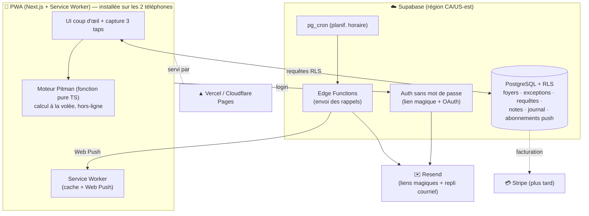

# Phase 3 — Architecture

> Découle directement de la Phase 2. Chiffres de paliers gratuits = ordres de grandeur **à revérifier** (ils bougent).
> Contraintes pilotes : **0 $ au lancement → SaaS payant**, **mainteneur solo non-spécialiste**, **multi-tenant jour 1**, **PWA + push**, **moteur déterministe**, **Loi 25 à l'échelle**.

## 1. Critères de décision (pondérés)

| Critère | Poids | Pourquoi |
|---|---|---|
| Faible charge pour un solo non-expert | ⭐⭐⭐ | R5 : un seul mainteneur ; tout ce qui est « assemblé à la main » est une dette |
| Auth sans mot de passe **incluse** | ⭐⭐⭐ | La pièce la plus dure à coder soi-même |
| Isolation multi-tenant **sûre** | ⭐⭐⭐ | NFR-9, R7 (étanchéité du motif) |
| 0 $ réel au départ | ⭐⭐⭐ | NFR-7 |
| Chemin vers SaaS payant sans refonte | ⭐⭐ | CON4 |
| Pas de verrou (sortie possible) | ⭐⭐ | NFR-14, R4 |
| Modèle de données adapté (relationnel) | ⭐⭐ | Foyers, requêtes, journal = relationnel |
| Push fiable | ⭐⭐ | R11 (mais plafonné par iOS, voir §5.7) |

## 2. Scénarios comparés

### Scénario A — **Supabase + Next.js (PWA)** ✅ recommandé
Socle géré bâti sur **PostgreSQL** : Auth, BD, Row-Level Security (RLS), Edge Functions, Realtime, Storage. Front Next.js (React) en PWA.

### Scénario B — Firebase + PWA
BaaS Google : **Firestore (NoSQL)**, Firebase Auth, Cloud Functions, **FCM** (push de référence).

### Scénario C — Edge « lean » (Cloudflare)
Workers + **D1 (SQLite)** + Queues + Cron + Pages. Le moins cher à l'échelle, mais auth/RLS à assembler soi-même.

> **No-code (Bubble/Glide…) — considéré, rejeté.** Excellent pour prototyper, mais le moteur Pitman, le modèle de vie privée (motif étanche), la planification des push et la facturation SaaS le feraient « déborder » vite. Mauvais pari pour un produit destiné à devenir payant.

### Tableau comparatif

| Critère | A · Supabase | B · Firebase | C · Cloudflare |
|---|---|---|---|
| Charge pour un solo | 🟢 faible | 🟡 moyenne | 🔴 élevée (DIY auth) |
| Auth sans mot de passe incluse | 🟢 oui | 🟢 oui | 🔴 à coder/Clerk |
| Isolation multi-tenant | 🟢 **RLS Postgres** (au niveau BD) | 🟡 règles Firestore | 🟡 applicative |
| Modèle de données | 🟢 relationnel (parfait) | 🔴 NoSQL (mauvais ajustement) | 🟢 SQLite |
| 0 $ au départ | 🟢 oui | 🟢 oui | 🟢 oui (le + généreux) |
| Push | 🟡 Web Push (à câbler) | 🟢 FCM | 🟡 Web Push (à câbler) |
| Verrou fournisseur | 🟢 open-source, auto-hébergeable | 🔴 propriétaire Google | 🟡 moyen |
| Chemin SaaS payant | 🟢 Stripe + plans | 🟢 oui | 🟢 oui |
| Résidence des données (Loi 25) | 🟢 région au choix | 🟡 régionalisable | 🟢 |
| **Risque principal** | projet gratuit en pause après ~1 sem. d'inactivité | NoSQL piège le non-expert ; lock-in | charge de construction trop lourde en solo |

## 3. Recommandation : **Scénario A — Supabase + Next.js PWA**

**Pourquoi A gagne pour CE projet :**
1. **Il supprime la pièce la plus dure** : l'auth sans mot de passe (lien magique + Google/Apple) est native → R5 désamorcé.
2. **La sécurité multi-tenant est portée par la BD, pas par votre code.** Une politique RLS « l'utilisateur ne voit que son foyer » remplace mille vérifications fragiles → NFR-9 et l'**étanchéité du motif** (R7) deviennent structurelles, pas une discipline.
3. **Postgres colle au domaine** (foyers, membres, exceptions, requêtes, notes, journal). Firestore (NoSQL) obligerait un non-expert à dénormaliser et se piéger.
4. **Open-source → pas de verrou.** Si les coûts explosent, on auto-héberge le même code → R4/NFR-14.
5. **Chemin SaaS clair** : Stripe + plans, région de données canadienne/US-est pour la Loi 25.

> Le push n'est PAS un facteur décisif : la vraie limite (iOS exige une PWA installée) est une contrainte **d'Apple**, identique pour A et B. FCM de Firebase ne la lève pas. Donc on garde A et on câble Web Push + repli courriel (§5.7).

**Honnêteté sur le défaut de A :** le projet **gratuit Supabase se met en pause après ~1 semaine sans requête**. Pour une app à usage quotidien, peu probable ; sinon un *ping* de surveillance (qui sert aussi de monitoring d'uptime) le garde éveillé, et le plan payant (~25 $/mois) le supprime quand le SaaS génèrera des revenus.

## 4. Architecture cible



### 5.1 Frontend
- **Next.js (App Router, React, TypeScript)** en **PWA** : manifeste + service worker (cache hors-ligne + réception Web Push). Recommandé pour l'écosystème le mieux documenté (atout pour un solo assisté par IA).
- **UI TDAH** : accueil « coup d'œil » (grosse pastille du jour), capture exception = 1 bouton → 6 grosses tuiles (≤ 3 taps). Tailwind + une lib de composants accessibles (ex. shadcn/ui). Fort contraste, peu de texte (NFR-12).
- **i18n** français d'abord (NFR-13), structure prête pour bilingue.
- **Tout l'horaire est calculé côté client** par le moteur → instantané, fonctionne hors-ligne (NFR-4).

### 5.2 Le moteur déterministe (cœur, FR-1)
Fonction **pure** partagée (TS), exécutable client **et** serveur :
```
shiftForDate(team, date, cycleTemplate) -> { working, shift: 'jour'|'nuit'|null, superCrew: 'AC'|'BD' }
```
- `cycleTemplate = { anchorDate: 2026-06-03, pattern: [14 booléens A/C], dayHours, nightHours }`.
- `i = floorDays(date - anchorDate) mod 14` → `pattern[i]` donne A/C vs B/D ; l'équipe donne jour/nuit.
- **Aucune date stockée** : on génère à la volée → coût quasi nul (O-8). On ne persiste que les **écarts** (exceptions) et la fenêtre de sommeil, superposés par-dessus.

### 5.3 Base de données (Postgres) + isolation
Tables clés (toutes porteuses de `household_id`) :
`households` · `profiles` · `memberships(role)` · `cycle_templates` · `worker_assignments(team)` · `exceptions` · `exception_private(motif)` · `sleep_defaults` · `notes` · `requests(status)` · `reminders` · `audit_log` · `push_subscriptions`.
- **RLS partout** : politique « membre du foyer » → isolation multi-tenant au niveau BD (NFR-9).
- **Étanchéité du motif (R7, NFR-5)** : le motif vit dans une table **séparée** `exception_private`, lisible **uniquement par le travailleur** (politique RLS stricte). La conjointe lit `exceptions` (présent/absent) sans jamais toucher le motif. La vie privée devient **structurelle**, pas une discipline.
- **Journal (FR-13)** : `audit_log` alimenté par triggers/Edge Functions.

### 5.4 Authentification (FR-11)
- **Supabase Auth** : lien magique par courriel + **Google/Apple OAuth**. Pas de mot de passe (anti-oubli TDAH).
- **Foyer (FR-12)** : le propriétaire invite la conjointe par lien/code à usage unique → crée une `membership(role='spouse')`. **Révocation** = suppression de la membership (SEC5). La conjointe peut quitter et effacer ses notes.
- 2FA optionnelle (TOTP), non imposée.

### 5.5 Notifications (FR-10)
- **Web Push** (clés VAPID) : abonnement stocké dans `push_subscriptions`, réception par le service worker.
- **Planification 1 mois / 1 sem / 1 jour** : `pg_cron` réveille une **Edge Function** chaque heure → lit les `reminders` dus → envoie Web Push **+ courriel de repli** (échéances importantes).
- **Repli courriel via Resend** (palier gratuit ~3 000/mois) — sert aussi aux liens magiques. Garantit que les rappels passent même si le push échoue (R11).
- Déclencheurs : tout changement d'exception et toute requête conjointe émettent un `reminder`/une notif temps réel (Supabase Realtime pour l'in-app).

### 5.6 Déploiement & CI/CD
- **Front sur Vercel (Hobby, 0 $)** pour la vélocité — *ou* **Cloudflare Pages** (voir §7, clause d'usage commercial).
- **GitHub → déploiement auto** ; **migrations BD** versionnées via Supabase CLI dans une GitHub Action ; déploiements de prévisualisation sur les PR.
- Secrets (clés VAPID, Resend, Supabase service role) en variables d'environnement chiffrées.

### 5.7 Push sur iOS — le mur d'Apple (R11)
iOS n'accepte le Web Push **que pour une PWA installée** (« Ajouter à l'écran d'accueil ») depuis iOS 16.4. Parade :
1. Onboarding qui **guide l'installation** sur l'iPhone.
2. **Repli courriel systématique** pour les 3 échéances clés.
3. **Tester tôt sur votre vrai iPhone** (U-7) avant d'investir dans le reste.

### 5.8 Monitoring
- **Sentry** (palier gratuit) : erreurs front + Edge Functions.
- **Tableau de bord Supabase** : BD, logs, requêtes lentes.
- **UptimeRobot / Better Stack (gratuit)** : ping régulier → alerte **et** garde le projet Supabase éveillé (double usage).

### 5.9 Sauvegardes (NFR-11)
- Sur le **palier gratuit**, les sauvegardes sont limitées → mettre en place un **`pg_dump` planifié** (GitHub Action quotidienne) vers un stockage privé chiffré.
- Au passage au **plan payant** : sauvegardes quotidiennes gérées + **PITR** (restauration à un instant T).
- Tester la **restauration** au moins une fois (une sauvegarde jamais restaurée n'existe pas).

### 5.10 Coûts — trajectoire
| Étape | Front | BaaS | Courriel | Push | Total |
|---|---|---|---|---|---|
| Lancement (votre foyer) | Vercel Hobby 0 $ | Supabase Free 0 $ | Resend Free 0 $ | Web Push 0 $ | **0 $/mois** |
| Croissance (dizaines de foyers) | 0 $ | 0 $ (surveiller pause) | 0 $ | 0 $ | **~0 $** |
| SaaS payant | Vercel Pro ~20 $ *ou* CF Pages | Supabase Pro ~25 $ | Resend ~20 $ | 0 $ | **~45–65 $/mois** (couvert par les abonnements) |

### 5.11 Conformité Loi 25 / PIPEDA (NFR-6) — dès le 2ᵉ foyer
- **Région de données** nord-américaine au provisionnement Supabase.
- **Politique de confidentialité** + consentement à l'inscription ; **minimisation** (déjà : pas de motif détaillé partagé, pas de paie).
- Désignation d'un **responsable de la protection des renseignements personnels** (vous), procédure d'accès/suppression (droit à l'oubli déjà prévu, DAT3).

## 6. Risques d'architecture résiduels

| Risque | Parade |
|---|---|
| Pause du projet Supabase gratuit | Ping de monitoring (double usage) ; plan payant à la monétisation |
| Sauvegardes faibles en gratuit | `pg_dump` planifié vers stockage chiffré |
| Push iOS capricieux | Repli courriel + onboarding d'installation + test précoce |
| Clause non-commerciale Vercel Hobby | Démarrer pré-revenus, migrer Pro/Cloudflare à la monétisation (§7) |
| RLS mal écrite = fuite inter-foyers | Tests d'isolation automatisés ; revue des politiques |

## 7. Décision ouverte (un seul vrai fork)

**Hébergement du front :**
- **Vercel Hobby** — DX imbattable avec Next.js, 0 $… mais **usage non commercial** au palier gratuit → à migrer vers Pro (~20 $) quand ce sera payant.
- **Cloudflare Pages** — usage commercial OK même en gratuit, mais Next.js y demande un adaptateur (quelques aspérités).

→ **Reco** : démarrer sur **Vercel Hobby** (vous êtes pré-revenus, priorité à la vitesse), planifier la bascule à la monétisation. Sinon Cloudflare dès le départ pour éviter toute migration.

## 8. Prochaine étape proposée

Découper le **MVP** (FR-1→7, 10, 11, 12) en lots livrables et **échafauder le dépôt** : Next.js PWA + projet Supabase + le **moteur Pitman avec ses tests** (la brique la plus sûre pour démarrer, déjà spécifiée et validée).
